* Appendix: Requirements
    * Use cases

--------------------------------------------------------------------------------------------------------------------

## **Setting up, getting started**

Refer to the guide [_Setting up and getting started_](SettingUp.md).

--------------------------------------------------------------------------------------------------------------------

## **Design**

### Architecture

The ***Architecture Diagram*** given above explains the high-level design of the App. Given below is a quick overview of
each component.

:bulb: **Tip:** The `.puml` files used to create diagrams in this document can be found in
the [diagrams](https://github.com/se-edu/addressbook-level3/tree/master/docs/diagrams/) folder. Refer to the [_PlantUML
Tutorial_ at se-edu/guides](https://se-education.org/guides/tutorials/plantUml.html) to learn how to create and edit
diagrams.

**`Main`** has two classes
called [`Main`](https://github.com/AY2021S2-CS2103T-T13-3/tp/blob/master/src/main/java/seedu/address/Main.java)
and [`MainApp`](https://github.com/AY2021S2-CS2103T-T13-3/tp/blob/master/src/main/java/seedu/address/MainApp.java). It
is responsible for,

* At app launch: Initializes the components in the correct sequence, and connects them up with each other.
* At shut down: Shuts down the components and invokes cleanup methods where necessary.

[**`Commons`**](#common-classes) represents a collection of classes used by multiple other components.

The rest of the App consists of four components.

* [**`UI`**](#ui-component): The UI of the App.
* [**`Logic`**](#logic-component): The command executor.
* [**`Model`**](#model-component): Holds the data of the App in memory.
* [**`Storage`**](#storage-component): Reads data from, and writes data to, the hard disk.

Each of the four components,

* defines its *API* in an `interface` with the same name as the Component.
* exposes its functionality using a concrete `{Component Name}Manager` class (which implements the corresponding
  API `interface` mentioned in the previous point.

For example, the `Logic` component (see the class diagram given below) defines its API in the `Logic.java` interface and
exposes its functionality using the `LogicManager.java` class which implements the `Logic` interface.

**How the architecture components interact with each other**

The *Sequence Diagram* below shows how the components interact with each other for the scenario where the user issues
the command `delete 1`.

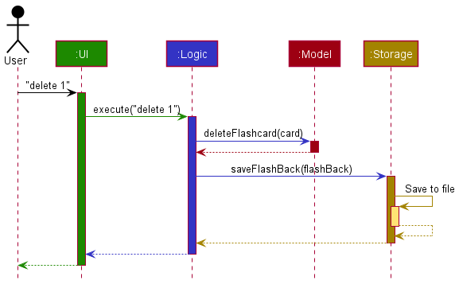

The sections below give more details of each component.

### UI component

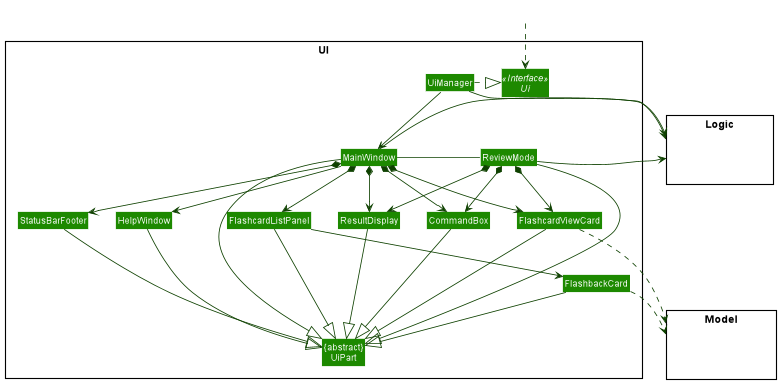

**API** :
[`Ui.java`](https://github.com/AY2021S2-CS2103T-T13-3/tp/blob/master/src/main/java/seedu/address/ui/Ui.java)

The UI consists of a `MainWindow` that is made up of parts e.g.`CommandBox`, `ResultDisplay`, `FlashcardListPanel`
, `StatusBarFooter` etc and a `ReviewMode` that is made up of parts `CommandBox`, `ResultDisplay` and `FlashcardViewCard` . All these, including the `MainWindow` and `ReviewMode`, inherit from the abstract `UiPart` class.

The `ReviewMode` can be accessed from `MainWindow` through `review` command. The `MainWindow` can be accessed from `ReviewMode` through `q` command.

The `UI` component uses JavaFx UI framework. The layout of these UI parts are defined in matching `.fxml` files that are
in the `src/main/resources/view` folder. For example, the layout of
the [`MainWindow`](https://github.com/AY2021S2-CS2103T-T13-3/tp/blob/master/src/main/java/seedu/address/ui/MainWindow.java)
is specified
in [`MainWindow.fxml`](https://github.com/AY2021S2-CS2103T-T13-3/tp/blob/master/src/main/resources/view/MainWindow.fxml)

The `UI` component,

* Executes user commands using the `Logic` component.
* Listens for changes to `Model` data so that the UI can be updated with the modified data.

### Logic component

**API** :
[`Logic.java`](https://github.com/AY2021S2-CS2103T-T13-3/tp/blob/master/src/main/java/seedu/address/logic/Logic.java)

1. `Logic` uses the `FlashBackParser` class to parse the user command.
1. This results in a `Command` object which is executed by the `LogicManager`.
1. The command execution can affect the `Model` (e.g. adding a new card).
1. The result of the command execution is encapsulated as a `CommandResult` object which is passed back to the `Ui`.
1. In addition, the `CommandResult` object can also instruct the `Ui` to perform certain actions, such as displaying
   help to the user.

Given below is the Sequence Diagram for interactions within the `Logic` component for the `execute("delete 1")` API
call.

:information_source: **Note:** The lifeline for `DeleteCommandParser` should end at the destroy marker (X) but due to a limitation of PlantUML, the lifeline reaches the end of diagram.

### Model component

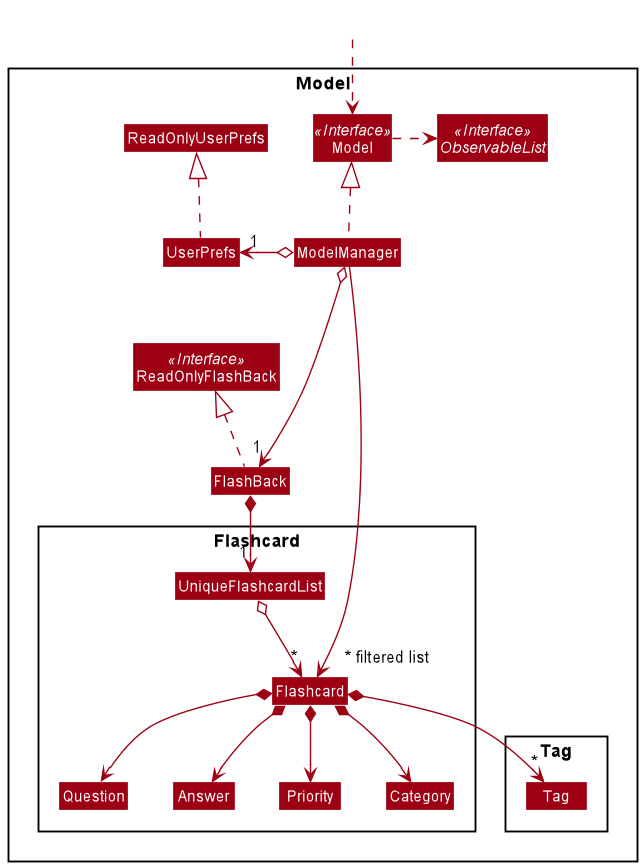

**API** : [`Model.java`](https://github.com/se-edu/addressbook-level3/tree/master/src/main/java/seedu/address/model/Model.java)

The `Model`
* stores a `UserPref` object that represents the user’s preferences.
* stores the address book data.
* exposes an unmodifiable `ObservableList<Person>` that can be 'observed' e.g. the UI can be bound to this list so that
  the UI automatically updates when the data in the list change.
* does not depend on any of the other three components.

:information_source: **Note:** An alternative (arguably, a more OOP) model is given below. It has a `Tag` list in the `AddressBook`, which `Person` references. This allows `AddressBook` to only require one `Tag` object per unique `Tag`, instead of each `Person` needing their own `Tag` object. 

### Storage component

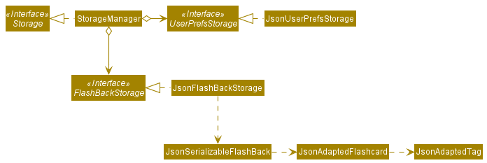

**API** : [`Storage.java`](https://github.com/AY2021S2-CS2103T-T13-3/tp/blob/master/src/main/java/seedu/address/storage/Storage.java)

The `Storage` component,

* can save `UserPref` objects in json format and read it back.
* can save the FlashBack data in json format and read it back.

### Common classes

Classes used by multiple components are in the `seedu.addressbook.commons` package.

--------------------------------------------------------------------------------------------------------------------

## **Implementation**

This section describes some noteworthy details on how certain features are implemented.

### \[Implemented\] Sort feature
The sort mechanism is managed by `ModelManager`. As `Flashcard` contains `Question` and `Priority`, these are utilised along with the enum `SortOptions` which
comprises comparators needed for respective sort options.

It implements the following operations:

* `ModelManager#SortFilteredCardList(Comparator<Flashcard> cmp)` - Sorts the flashcard list
according to an option and shows the updated list.
* `SortOptions#getOption(String option)` - Returns the enum according to the specified option

The following sequence diagram illustrates how the sort function operates:
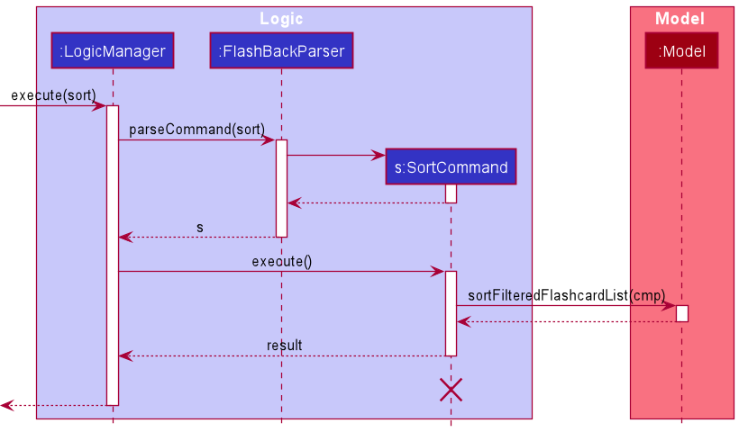

### \[Implemented\] Review feature
The review mechanism is managed by `ReviewManager`. It 
maintains a list of `Flashcard` and `currentIndex` internally. In addition, it involves the UI through `ReviewMode` that handles user inputs and displays flashcards to users.
 
 `ReviewManager` implements the following operations:
 * `ReviewManager#getFlashcardDeckSize()` - Returns the size of the current list of flashcards.
 * `ReviewManager#hasNextFlashcard()` - Checks if there is a flashcard after the current flashcard.
 * `ReviewManager#hasPreviousFlashcard()` - Checks if there is a flashcard before the current flashcard.
 * `ReviewManager#getCurrentFlashcard()` - Returns the flashcard at `currentIndex` of the flashcard list.
 * `ReviewManager#updateCardCorrect(Flashcard cardToUpdate)` - Updates the statistics of a specified `cardToUpdate` when user answers the question correctly.
 * `ReviewManager#updateCardWrong(Flashcard cardToUpdate)` - Updates the statistics of a specified `cardToUpdate` when user answers the question wrongly.
 
 The following class diagram illustrates how classes involved in this feature interact with each other:   
 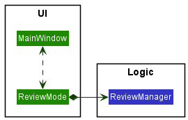   
Given below is an example usage scenario and how the review mechanism behaves at each step:

Step 1: The user launches the application.

Step 2: The user enters `review` command in `CommandBox`. After the logic executes the command, it returns a `CommandResult` to the `MainWindow` where the `CommandResult#isReviewMode()` method returns true. After that, a `MainWindow#enterReviewMode()` method is called and user enters `ReviewMode`.

Step 3: Depending on the command that user enters in the `CommandBox` of `ReviewMode`, different methods in `ReviewManager` are called to handle user inputs.

Step 4: If the user enters `q` in the `CommandBox`, `ReviewMode#handleQuitCommand` method is called, and the user returns back to the `MainWindow`.

The following sequence diagram illustrates how the user enter `ReviewMode`:  
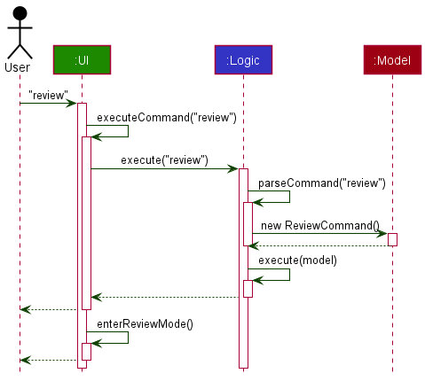   
### \[Proposed\] Undo/redo feature

#### Proposed Implementation

The proposed undo/redo mechanism is facilitated by `VersionedAddressBook`. It extends `AddressBook` with an undo/redo history, stored internally as an `addressBookStateList` and `currentStatePointer`. Additionally, it implements the
following operations:

* `VersionedAddressBook#commit()` — Saves the current address book state in its history.
* `VersionedAddressBook#undo()` — Restores the previous address book state from its history.
* `VersionedAddressBook#redo()` — Restores a previously undone address book state from its history.

These operations are exposed in the `Model` interface as `Model#commitAddressBook()`, `Model#undoAddressBook()`
and `Model#redoAddressBook()` respectively.

Given below is an example usage scenario and how the undo/redo mechanism behaves at each step.

Step 1. The user launches the application for the first time. The `VersionedAddressBook` will be initialized with the
initial address book state, and the `currentStatePointer` pointing to that single address book state.

Step 2. The user executes `delete 5` command to delete the 5th person in the address book. The `delete` command
calls `Model#commitAddressBook()`, causing the modified state of the address book after the `delete 5` command executes
to be saved in the `addressBookStateList`, and the `currentStatePointer` is shifted to the newly inserted address book
state.

Step 3. The user executes `add n/David …​` to add a new person. The `add` command also calls `Model#commitAddressBook()`
, causing another modified address book state to be saved into the `addressBookStateList`.

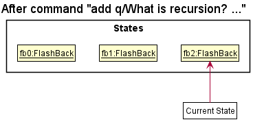

:information_source: **Note:** If a command fails its execution, it will not call `Model#commitAddressBook()`, so the address book state will not be saved into the `addressBookStateList`.

Step 4. The user now decides that adding the person was a mistake, and decides to undo that action by executing
the `undo` command. The `undo` command will call `Model#undoAddressBook()`, which will shift the `currentStatePointer`
once to the left, pointing it to the previous address book state, and restores the address book to that state.

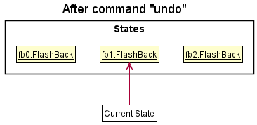

:information_source: **Note:** If the `currentStatePointer` is at index 0, pointing to the initial AddressBook state, then there are no previous AddressBook states to restore. The `undo` command uses `Model#canUndoAddressBook()` to check if this is the case. If so, it will return an error to the user rather
than attempting to perform the undo.

The following sequence diagram shows how the undo operation works:

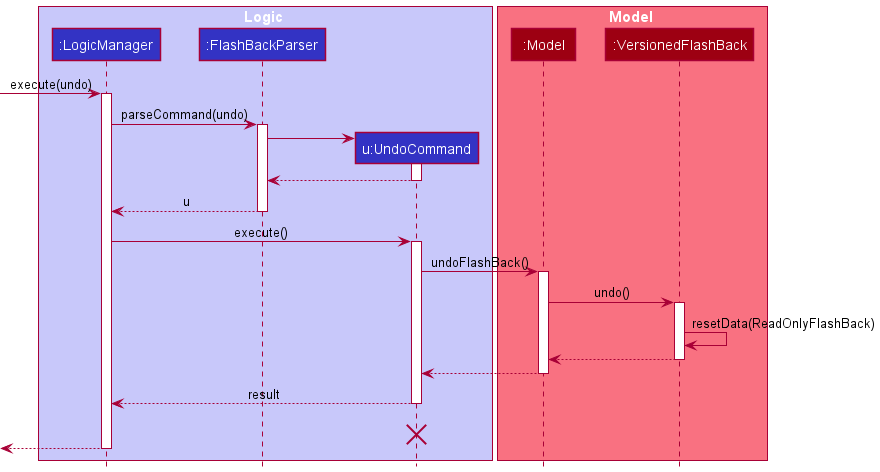

:information_source: **Note:** The lifeline for `UndoCommand` should end at the destroy marker (X) but due to a limitation of PlantUML, the lifeline reaches the end of diagram.

The `redo` command does the opposite — it calls `Model#redoAddressBook()`, which shifts the `currentStatePointer` once
to the right, pointing to the previously undone state, and restores the address book to that state.

:information_source: **Note:** If the `currentStatePointer` is at index `addressBookStateList.size() - 1`, pointing to the latest address book state, then there are no undone AddressBook states to restore. The `redo` command uses `Model#canRedoAddressBook()` to check if this is the case. If so, it will return an error to the user rather than attempting to perform the redo.

Step 5. The user then decides to execute the command `list`. Commands that do not modify the address book, such
as `list`, will usually not call `Model#commitAddressBook()`, `Model#undoAddressBook()` or `Model#redoAddressBook()`.
Thus, the `addressBookStateList` remains unchanged.

Step 6. The user executes `clear`, which calls `Model#commitAddressBook()`. Since the `currentStatePointer` is not
pointing at the end of the `addressBookStateList`, all address book states after the `currentStatePointer` will be
purged. Reason: It no longer makes sense to redo the `add n/David …​` command. This is the behavior that most modern
desktop applications follow.

The following activity diagram summarizes what happens when a user executes a new command:

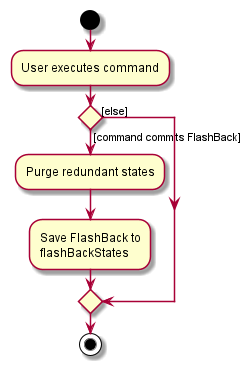

#### Design consideration:

##### Aspect: How undo & redo executes

* **Alternative 1 (current choice):** Saves the entire address book.
    * Pros: Easy to implement.
    * Cons: May have performance issues in terms of memory usage.

* **Alternative 2:** Individual command knows how to undo/redo by itself.
    * Pros: Will use less memory (e.g. for `delete`, just save the person being deleted).
    * Cons: We must ensure that the implementation of each individual command are correct.

_{more aspects and alternatives to be added}_

### \[Proposed\] Data archiving

_{Explain here how the data archiving feature will be implemented}_

--------------------------------------------------------------------------------------------------------------------

## **Documentation, logging, testing, configuration, dev-ops**

* [Documentation guide](Documentation.md)
* [Testing guide](Testing.md)
* [Logging guide](Logging.md)
* [Configuration guide](Configuration.md)
* [DevOps guide](DevOps.md)

--------------------------------------------------------------------------------------------------------------------

## **Appendix: Requirements**

### Product scope

**Target user profile**:

* student revising for examinations
* has a hard time remembering concepts from different fields of study.
* prefers desktop apps over other types
* can type fast
* prefers typing to mouse interactions
* is reasonably comfortable using CLI apps

**Value proposition**: Offers productive study sessions to students via improved accessibility and organisation of
flashcards, as well as faster management of flashcards compared to a typical mouse/GUI driven app

### User stories

Priorities: High (must have) - `* * *`, Medium (nice to have) - `* *`, Low (unlikely to have) - `*`

| Priority | As a …​                                     |I want to …​                     | So that I can…​
| -------- | ------------------------------------------ | ------------------------------ | ----------------------------------------------------------------------
| `* * *`  | new user                                   | see usage instructions         | refer to instructions when I forget how to use the App
| `* * *`  | new user | use the app with sample data | see how the app look like
| `* * *`  | student                                    | add a new card                 | take down important concepts for future reference
| `* * *`  | long-time user                             | delete an old card             | remove some notes that I no longer need
| `* * *`  | student                                    | view all my notes   | easily refer to all my study materials
| `* * *`  | student                                    | view the question and answer of a specific card | check if I remember the concepts correctly
| `* * * ` | careless user | modify the details of a flash card | avoid having to delete and add a new card when I wish to update card information
| `* *` | multi-discipline student | put my notes under different tags and categories | easily organize them
| `* *`     | angry student   | undo/redo my actions| my emotion will not cloud my judgements
| `* *` | student | review my own performance after each study session | know what to improve on
| `* *` | student | sort the cards based on priority | know which cards I should focus on
| `* *` | long-time user | find what I need easily | search through the list of decks without doing it manually
| `*`   | student | export a part of my materials | share it with others
| `*`   | experienced user | define my own aliases for commands | use them faster
| `*`   | chemistry/biology Student | use subscripts | see the chemical formula easier
| `*`   | careless student | archive my notes | easily restore them
| `*`   | student | look at the statistics | focus on topics that I am not good at

### Use cases

(For all use cases below, the **System** is the `FlashBack` and the **Actor** is the `user`, unless specified
otherwise)   
**Use case: UC01 - Add a flash card**

**MSS**

1. User requests to add a new flash card into the list.
2. FlashBack adds the new flashcard.

   Use case ends.

**Extensions**

* 1a. The given fields are empty.
    * 1a1. FlashBack shows an error message.

      Use case ends.

**Use case: UC02 - Remove a flash card**

**MSS**

1. FlashBack shows a list of flash cards
2. User requests to delete a specific flash card from the list
3. FlashBack deletes the specified flash card

   Use case ends.

**Extensions**

* 1a. The list is empty.

  Use case ends.

* 2a. The given index is invalid.
    * 2a1. FlashBack shows an error message.

      Use case resumes at step 1.

**Use case: UC03 - Edit a flash card**

**MSS**

1. FlashBack shows a list of flash cards.
2. User requests to edit a specific flash card on the list.
3. User enters the details of updated flash card.
4. FlashBack updates the flash card with the given details.

   Use case ends

**Extensions**

* 1a. The list is empty.

  Use case ends.

* 2a. The given index is invalid.
    * 2a1. FlashBack shows an error message.

      Use case resumes at step 1.

* 3a. The updated flash card is a duplicate of an existing card.
    * 3a1. FlashBack shows an error message.

      Use case resumes at step 1.

**Use case: UC04 - View a flash card**

**MSS**

1. FlashBack shows the list of flashcards.
1. User requests to view a specific flashcard on the list.
1. FlashBack shows the requested card.

   Use case ends.

**Extensions**

* 1a. The list is empty.

  Use case ends.

* 2a. The given index is invalid.
    * 2a1. FlashBack shows an error message.

      Use case resumes at step 1.

**Use case: UC05 - Find cards by search criteria**

**MSS**

1. User requests to find cards by criteria with given keywords.
1. FlashBack shows a list of flashcards matching given keywords according to search criteria.

   Use case ends.

**Extensions**

* 1a. The list is empty.

  Use case ends.

* 1b. The search criteria is invalid or empty keywords.
    * 1b1. FlashBack shows an error message.

      Use case ends

**Use case: UC06 - List all flash cards**

**MSS**

1. User requests to list all flash cards.
1. FlashBack shows a list of flash cards.

   Use case ends.

**Use case: UC07 - Undo an undoable command**

**MSS**

1. User requests to delete a flash card from the list.
1. FlashBack deletes the specified flashcard.
1. User requests to undo delete command.
1. FlashBack reverts to its previous state before delete command.

   Use case ends.

### Non-Functional Requirements

1. Should work on any _mainstream OS_ as long as it has Java `11` or above installed.
2. Should be able to respond to user commands within 3 seconds for up to 1000 cards.
3. A user with above average typing speed for regular English text (i.e. not code, not system admin commands) should be
   able to accomplish most of the tasks faster using commands than using the mouse.

*{More to be added}*

### Glossary

* **Mainstream OS**: Windows, Linux, Unix, OS-X
* **Flashcard**: A card that contains study materials with its topic name
* **Undoable Command**: A command that modifies the content of FlashBack

--------------------------------------------------------------------------------------------------------------------
