FlashBack is a **desktop application for managing notes, optimized for use via a Command Line Interface** (CLI) while still having the benefits of a Graphical User Interface (GUI). This application allows the improvement of student performance via improved accessibility and organisation of notes, together with interactive sessions that enhance memory retention.

## Table of Contents

* [Quick start](#quick-start)
* [Application layout](#application-layout)
* [Features](#features)
    * [Main mode](#main-mode)
        * [Viewing help](#viewing-help-help): `help`
        * [Adding a new flashcard](#adding-a-new-flashcard-add): `add`
        * [Editing a flashcard](#editing-a-flashcard-edit): `edit`
        * [Listing all flashcards](#listing-all-flashcards--list): `list`
        * [Deleting a flashcard](#deleting-a-flashcard--delete): `delete`
        * [Viewing a flashcard](#viewing-a-flashcard--view): `view`
        * [Finding flashcards](#finding-flashcards--find): `find`
        * [Filtering flashcards](#filtering-flashcards-filter): `filter`
        * [Clearing all flashcards](#clearing-all-entries--clear): `clear`
        * [Undoing a command](#undoing-a-command--undo): `undo`
        * [Redoing a command](#redoing-a-command--redo): `redo`
        * [Sorting all flashcards](#sorting-all-flashcards-sort): `sort`
        * [Entering review mode](#entering-review-mode-review): `review`
        * [Viewing statistics of flashcards](#viewing-statistics-of-flashcards-stats): `stats`
        * [Adding an alias](#adding-an-alias-alias): `alias`
        * [Exiting the program](#exiting-the-program--exit): `exit`
        * [Saving data](#saving-the-data)
        * [Editing the data file](#editing-the-data-file)
    * [Review mode](#review-mode)
        * [Showing next flashcard](#showing-next-flashcard--n): `n`
        * [Showing previous flashcard](#showing-previous-flashcard--p): `p`
        * [Showing answer](#showing-answer--a): `a`
        * [Hiding answer](#hiding-answer--h): `h`
        * [Reviewing a flashcard as correct](#reviewing-a-flashcard-as-correct-t): `t`
        * [Reviewing a flashcard as wrong](#reviewing-a-flashcard-as-wrong--f): `f` 
        * [Quitting review mode](#quitting-review-mode--q): `q`
* [FAQ](#faq)
* [Command Summary](#command-summary)
    * [Main mode command](#main-mode-command)
    * [Review mode command](#review-mode-command)

--------------------------------------------------------------------------------------------------------------------

## Quick start

1. Ensure you have Java `11` or above installed in your Computer.
1. Download the latest `FlashBack.jar` from [here](https://github.com/AY2021S2-CS2103T-T13-3/tp/releases).
1. Copy the file to the folder you want to use as the home folder for your FlashBack.
1. Double-click the file to start the app. The GUI should appear in a few seconds.   
      
1. Below are some commands you can try, type the command in the command box and press Enter to execute it:
    * **`help`** : Opens the help window.
    * **`add`**`q/ What is the Einstein’s Equation? a/e=mc^2 c/Physics p/High t/ModernPhysics`: Adds a new flashcard
      named `What is the Einstein's Equation?` to FlashBack.
    * **`view`**`2`: Views the 2nd flashcard shown in the current list.
    * **`delete`**`1`: Deletes the 1st flashcard shown in the current list.
    * **`clear`**: Deletes all flashcards.
    * **`exit`**: Exits the application.
1. Refer to the Features below for details of each command.

--------------------------------------------------------------------------------------------------------------------

## Application layout

The figures below explain the different components in FlashBack.  
Main window 
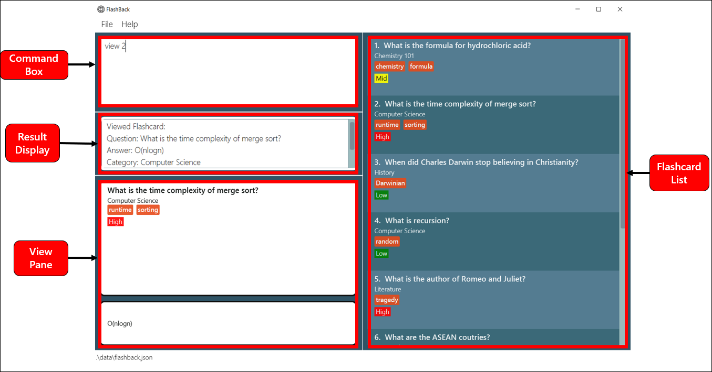  
Review mode  
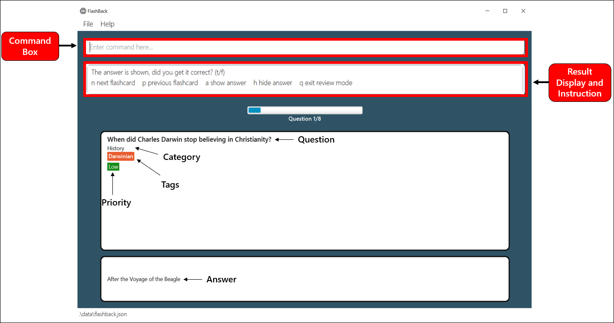   
Brief explanation of each components:

Components      | Explanation
----------------|------------------
Command Box | This is where you type all the commands.
Result Display | This is where the result of your input to the command box is displayed.
View Pane | This is where the output for `view` and `stats` command is displayed.
Flashcard List | This is where all the flashcards are displayed to user.
Main mode | This is the first window when you open the app. Most of the command is executed here.
Review mode | This is where you can review all your flashcards. You can enter this mode by typing `review` in the Command Box of the Main mode.

--------------------------------------------------------------------------------------------------------------------

## Features

**:information_source: Notes about the command format:** 

* Words in UPPER_CASE are the parameters to be supplied by the user.  
  e.g. In `add q/QUESTION`, `QUESTION` is a parameter which can be used as `add q/What is Fermat's Last Theorem?`. 

* Items in square brackets are optional.  
  e.g. `q/QUESTION [t/TAG]` can be used as `q/What is Singapore Independence Day?` or
  as `q/What is Singapore Independence Day? t/Singapore` 

* Items with `…​` after them can be used multiple times including zero times.  
  e.g. `[t/TAG]…`​ can be used as `t/vocabulary`, `t/vocabulary t/SAT` etc.

* Parameters can be in any order.  
  e.g. If the command specifies `q/QUESTION a/ANSWER`, `a/ANSWER q/QUESTION` is also acceptable. 

* Extraneous parameters for commands that do not take in parameters (such as `help`, `list`, `undo`, `exit` and `clear`)
  will be ignored.  
  e.g. If the command specifies `help 123`, it will be interpreted as `help`.

* Prefixes are case-sensitive.  
  e.g. `q/` is not the same as `Q/`.

* If a parameter is expected only once in the command, but you specified it multiple times, only the last occurrence of the parameter will be taken.  
  e.g. If you specify `c/Geography c/History`, only `c/History` will be taken.
  
* For commands that accepts `INDEX` parameter (e.g. `edit`, `view`, `delete`, and `stats`):
    * The index refers to the index number shown in the displayed flashcard list.
    * The index **must be a positive integer** 1, 2, 3, …​ but not above 2147483647.

## Main mode

### Viewing help: `help`

Shows a message explaining how to access the help page.  
   
Format: `help`

### Adding a new flashcard: `add`

Adds a new flashcard to the flashcard list. 
Format: `add q/QUESTION a/ANSWER c/CATEGORY p/PRIORITY [t/TAG]...`  

:memo: **Note:**  
The `TAG` is optional when adding a new flashcard. 
Priority can only take 1 out of 3 values: `High`, `Mid` or `Low`.

Examples:

* `add q/Einstein’s Equation a/e=mc^2 c/Physics p/High`   
  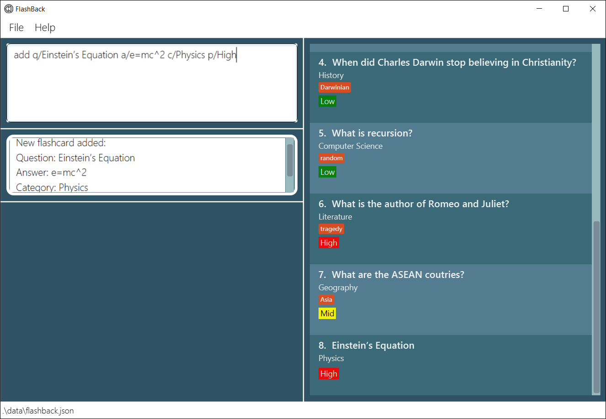   
* `add q/Independence day of Singapore a/August 9th 1965 c/History p/Mid t/Singapore`

### Editing a flashcard: `edit`

Edits an existing flashcard in the flashcard list.

Format: `edit INDEX [q/NEW QUESTION] [a/NEW ANSWER] [c/NEW CATEGORY] [p/NEW PRIORITY] [t/TAG]...`

* Edits the flashcard at the specified `INDEX`.
* At least 1 updated card field must be provided for modification.
* If the tag field is specified in the command, all existing tag(s) will be removed and replaced by the new tag(s).
* New tag(s) should be alphanumeric, and there should not be any spacing between characters.
* New priority can only be "Low", "Mid" or "High", case-sensitive.

Examples:

* `edit 1 p/Low`   
  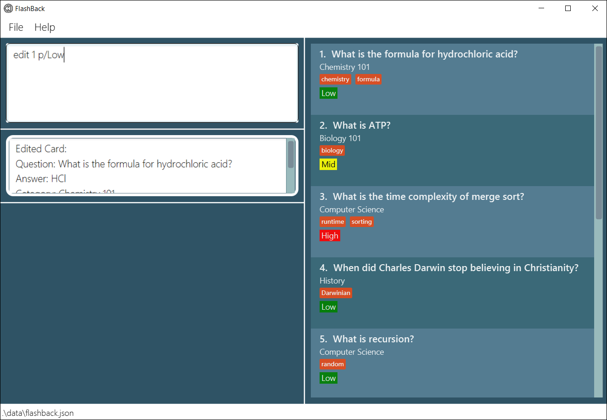   
* `edit 3 q/What is the time complexity for Quick Sort? t/Algorithms`

### Listing all flashcards : `list`

Shows all flashcards in the flashcard list.

Format: `list`

### Deleting a flashcard : `delete`

Deletes the specified flashcard from the flashcard list.  
Format: `delete INDEX`

* Deletes the flashcard at the specified `INDEX`.

Examples:

* `list` followed by `delete 2` deletes the 2nd flashcard in the flashcard list.  
  Before executing command `delete 2`:   
    
  

  
  After executing command `delete 2`:   
  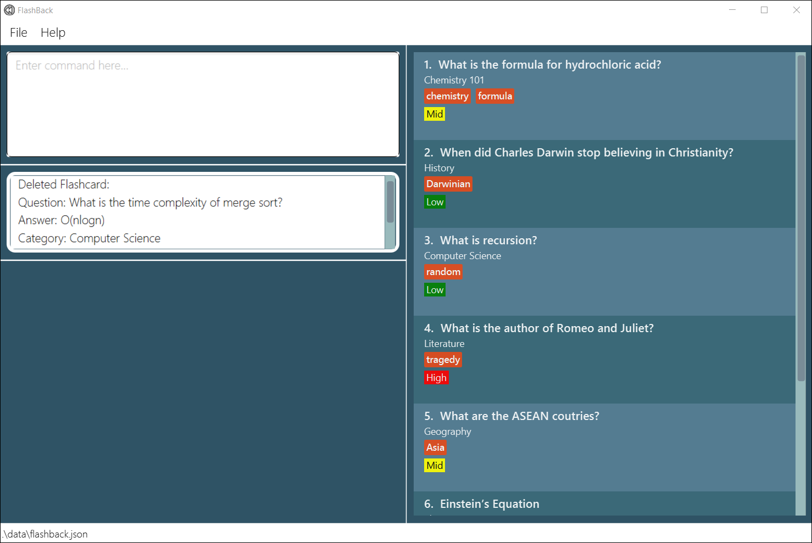

### Viewing a flashcard : `view`

Views a specific flashcard from the flashcard list.  

Format: `view INDEX`

* Views the flashcard at the specified `INDEX`.

Examples:

* `view 2` shows the 2nd flashcard (in the displayed flashcard list).   
  

### Finding flashcards : `find`

Finds flashcards containing any of the given keywords in FlashBack.

Format: `find KEYWORD [MORE_KEYWORDS]`

* The search is case-insensitive. e.g. `equation` will match `Equation`
* The order of the keywords does not matter. e.g. `Newton Equation` will match `Equation Newton`
* Partial words can be matched when searching. e.g. `Wh` will match `What?` but `What?` will not match `What`
* Any flashcard's fields (e.g. question, answer, category, priority, and tag) matching any keyword will be returned.

:bulb: **Tip:** You can list all flashcards again by using `list` command

Examples:
* `find computer` will return cards with `computer` in any of its fields.  
   
* `find computer formula` will return cards with `computer` or `formula` in any of its fields.  
  

* `find phy` will return cards with `phy` contained in any of the words in any of its fields.  
   

### Filtering flashcards: `filter`

Filter flashcards based on specified field input in FlashBack.

:bulb: **Note:** You can only filter by `question`, `category`, `priority`, and `tag`.

Format: `filter [q/QUESTION] [c/CATEGORY] [p/PRIORITY] [t/TAG]`

* The filter is case-insensitive. e.g. `equation` will match `Equation`
* Must filter by at least 1 field, but not every field is required.
* Can filter by multiple keywords for each field. e.g. `filter q/einstein math`
* The order of the keywords does not matter. e.g. `Newton Equation` will match `Equation Newton`
* The order of the field input does not matter. e.g. `filter q/QUESTION c/CATEGORY` is same as `filter c/CATEGORY q/QUESTION`
* Filtered flashcards must match all field inputs. e.g. `filter q/einstein p/mid` will only display flashcards with question containing `einstein` and `mid` priority.
* Partial words can be matched when filtering. e.g. `Wh` will match `What?` but `What?` will not match `What`

:bulb: **Tip:** You can list all flashcards again by using `list` command.

Examples:
* `filter q/charles recursion` will return cards with `charles` or `recursion` contained in its question.  
    
* `filter p/mid q/formula` will return cards with `formula` contained in its question and `mid` priority. 
    
* `filter c/com t/ran` will return cards with `com` contained in its category and `ran`contained in any of its tags. 
    

### Clearing all entries : `clear`

Clears all entries from FlashBack.

Format: `clear`

### Undoing a command : `undo`

Restores FlashBack to the state before the previous command was executed.

:memo:
**Note:**  Only commands that modify FlashBack's content can be reversed. (`add`, `delete`, `edit` and `clear`).

Format: `undo`

Examples:
`delete 3`   
  

`clear`   
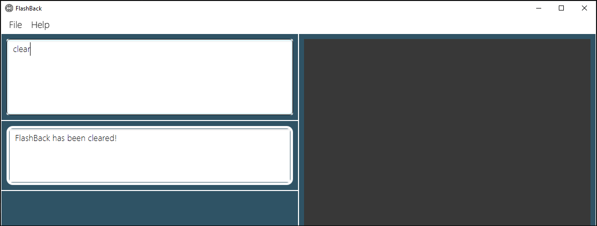   
`undo` will reverse the `clear` command.  
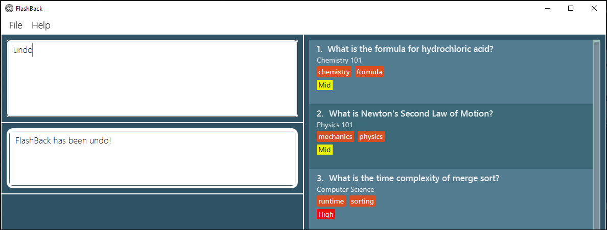   
`undo` will reverse the `delete 3` command.  
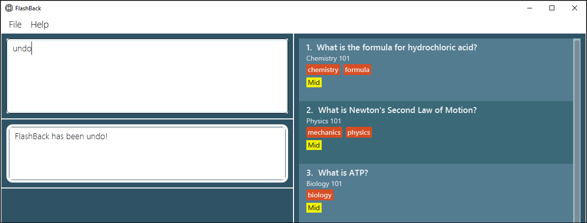   

### Redoing a command : `redo`

Restores FlashBack to the state before the previous command was undo.

Format: `redo`

Examples:
`clear`   
   
`undo` will reverse the `clear` command.   
   

`redo` will reverse the `undo` command.   
   

### Sorting all flashcards: `sort`
Sorts all flashcards according to a given option.

:bulb: **Note:** You can only sort by `priority` or `question`.

Format: `sort OPTION ORDER`  
Examples:

`sort priority -a` will sort the flashcards by ascending priority.  
`sort priority -d` will sort the flashcards by descending priority.  
`sort question -a` will sort the flashcards by ascending question.  
`sort question -d` will sort the flashcards by descending question.  

Before sort command is executed.   
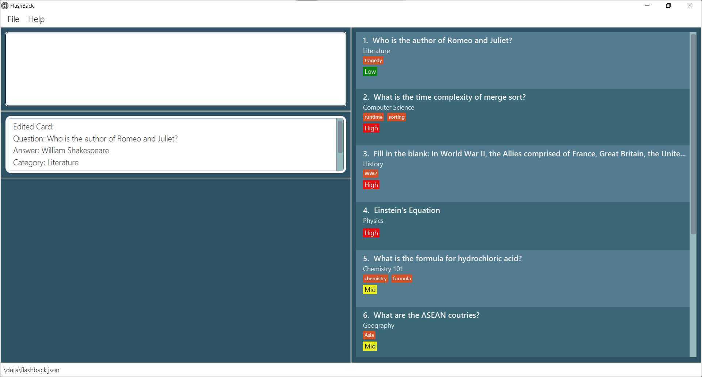   
`sort priority -a`  
After sort command is executed.   
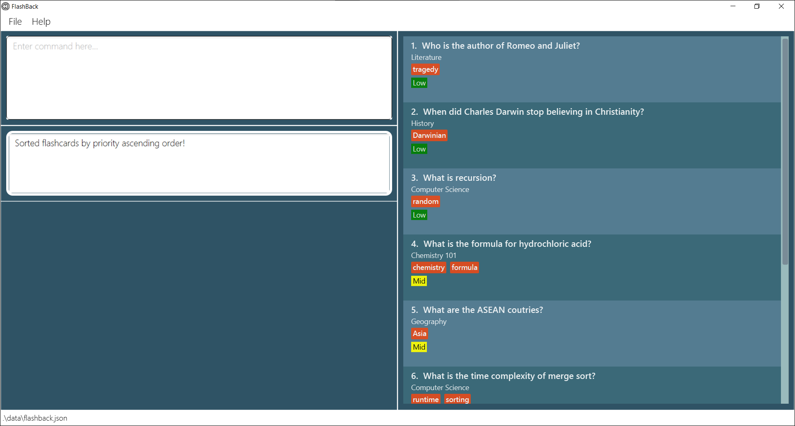

### Entering review mode: `review`
Reviews the current list of flashcards. 
When the user enters `review` in the command box, this new window will appear.   
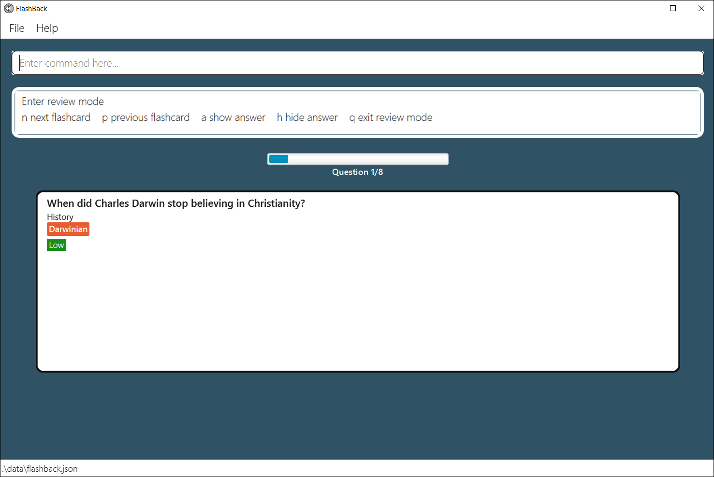   
Format: `review`

### Viewing statistics of flashcards: `stats`
Shows the statistics of an individual flashcard, or the statistics of all flashcards.

The following statistics are displayed:
* Number of times the user reviewed the flashcard(s).
* Number of times the user reviewed the flashcard(s) and got the correct answers.
* The correct rate of the flashcard(s). i.e The number of correct answer reviews over the total number of reviews.
* The wrong rate of the flashcard(s). i.e The number of wrong answer reviews over the total number of reviews.

Format: `stats INDEX`  

:memo: **Note:**
If a valid `INDEX` is provided, the statistics of the flashcard identified by the provided index is shown.
If the `INDEX` is omitted, FlashBack will display overall statistics for all flashcards in the current list.

Examples:

`stats 2` shows the statistics of the 2nd flashcard in the list.

   

`stats` shows the overall statistics of the current flashcard list.

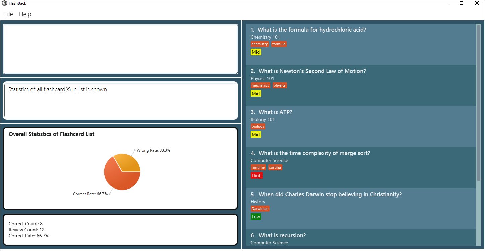   

### Adding an alias: `alias`
Define an alias for a command in FlashBack.

:bulb: **Note:** You can only add alias for Main mode commands.

Format: `alias cmd/COMMAND al/ALIAS`  

Examples:

`alias cmd/delete al/d` creates an alias `d` for command `delete`.

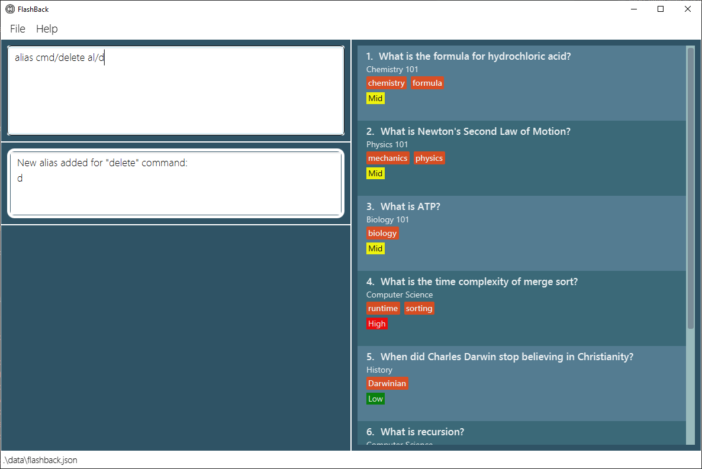   

`d 1` shows the usage of alias `d`.

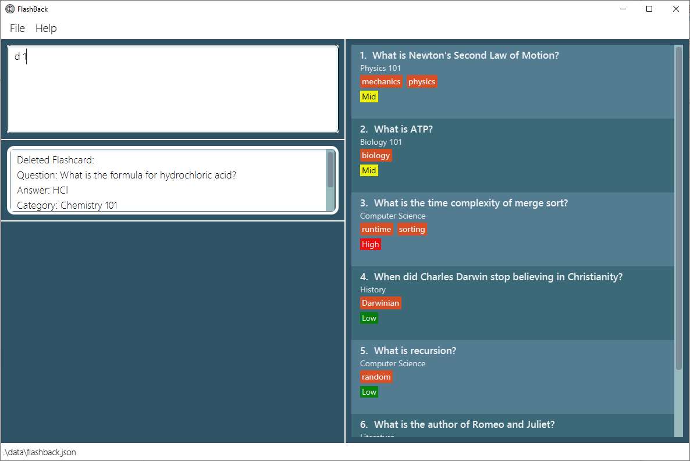   

### Exiting the program : `exit`

Exits the program.

Format: `exit`

### Saving the data

FlashBack data are saved in the hard disk automatically after any command that changes the data. There is no need to
save manually.

### Editing the data file

FlashBack data are saved as a JSON file `[JAR file location]/data/flashback.json`. Advanced users are welcome to update
data directly by editing that data file.

:exclamation: **Caution:**
If your changes to the data file makes its format invalid, FlashBack will discard all data and start with an empty data
file at the next run.

## Review mode

### Showing next flashcard : `n`

Moves on to the next flashcard. 
Format: `n`  
Example:   
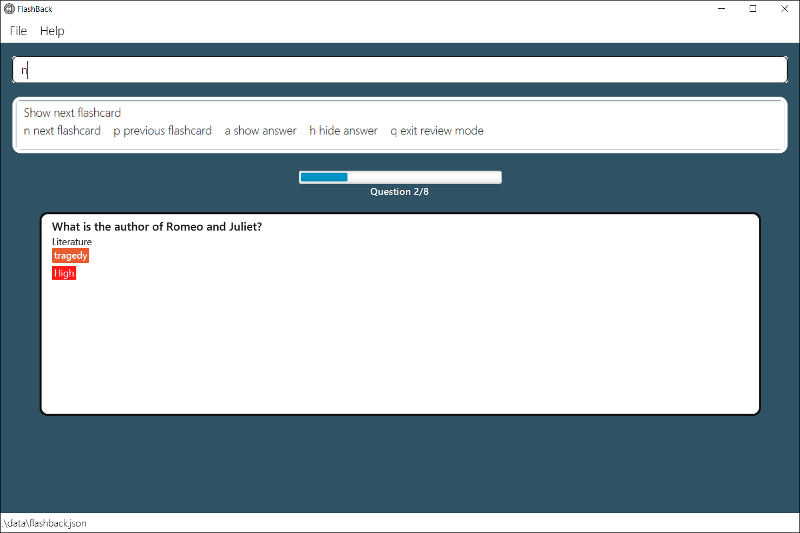

### Showing previous flashcard : `p`

Moves back to the previous flashcard.  
Format: `p`  
Example:   
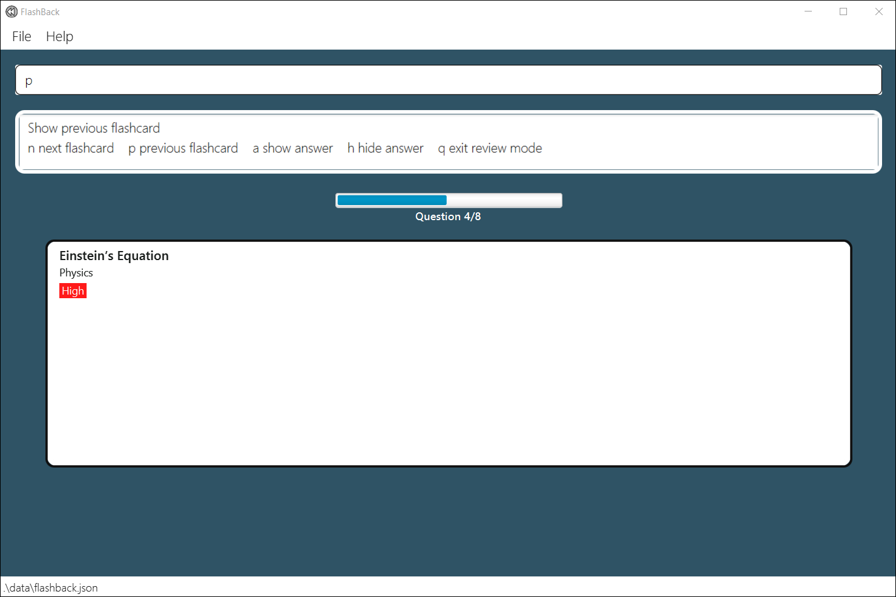

### Showing answer : `a`

Displays the answer of the current flashcard.  
Format: `a`  
Example:   

### Hiding answer : `h`

Hides the answer of the current flashcard.  
Format: `h`  
Example:   

### Reviewing a flashcard as correct: `t`

Marks that the user got the answer correct for the current flashcard.  

:bulb: **Note:** This command can only be executed if the answer of the current flashcard is shown.

Format: `t`  
Example:   

### Reviewing a flashcard as wrong : `f`

Marks that the user got the answer wrong for the current flashcard.  

:bulb: **Note:** This command can only be executed if the answer of the current flashcard is shown.

Format: `f`  
Example:   
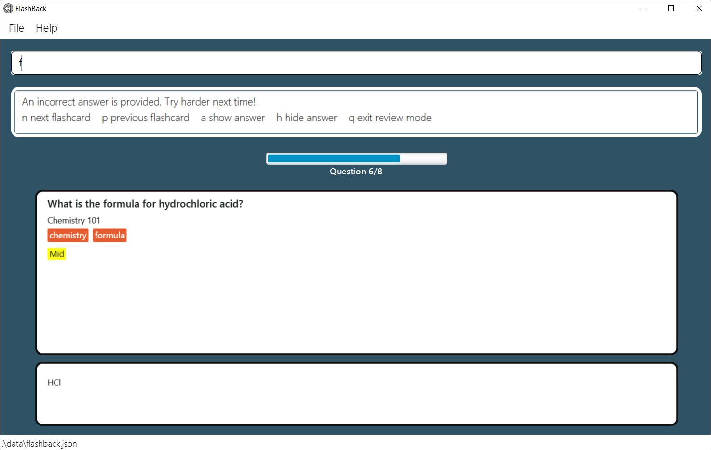

### Quitting review mode : `q`

Quits the review mode and goes back to the main window.  
Format: `q`  
Example:   

--------------------------------------------------------------------------------------------------------------------

## FAQ

**Q**: How do I transfer my data to another Computer? 
**A**: Install the app in the other computer and overwrite the empty data file it creates with the file that contains
the data of your previous FlashBack home folder.

--------------------------------------------------------------------------------------------------------------------

## Command summary

### Main mode command

Action | Format, Examples
--------|------------------
**Add** | `add q/QUESTION a/ANSWER c/CATEGORY p/PRIORITY [t/TAGS]...`   e.g. `add q/ What is the Einstein’s Equation? a/e=mc^2 c/Physics p/High t/ModernPhysics`
**Delete** | `delete INDEX`   e.g. `delete 1`
**Edit** | `edit INDEX`   e.g. `edit 3 a/NEW ANSWER p/NEW PRIORITY`
**View** | `view INDEX`   e.g. `view 2`
**Find** | `find KEYWORD [MORE_KEYWORDS]`  e.g. `find equation`
**Filter** | `filter [q/QUESTION] [c/CATEGORY] [p/PRIORITY] [t/TAG]`  e.g. `filter q/einstein c/phy p/high t/modern`   or `filter p/low t/formula`
**Clear** | `clear`
**Undo** | `undo`
**Redo** | `redo`
**Sort** | `sort OPTION ORDER`   e.g. `sort priority -a`
**Review** | `review`
**Statistics** | `stats [INDEX]`   e.g. `stats 4`, `stats`
**Alias** | `alias cmd/COMMAND al/ALIAS`   e.g. `alias cmd/add al/a`, `alias cmd/delete al/d`
**List** | `list`
**Help** | `help`
**Exit** | `exit`

### Review mode command

Action          | Format
----------------|------------------
**Next flashcard**   | `n`
**Previous flashcard** | `p`
**Show answer** | `a`
**Review a flashcard as correct** | `t`
**Review a flashcard as wrong** | `f`
**Hide answer** | `h`
**Quit review** | `q`
